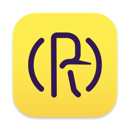

<p align="center">
  <a href="https://github.com/raptorxcz/Rubicon">
      
    </a>
</p>

# Rubicon
[](https://travis-ci.org/raptorxcz/Rubicon)
[](https://codecov.io/gh/raptorxcz/Rubicon)

**Available on AppStore [https://itunes.apple.com/cz/app/rubicon/id1453837387](https://itunes.apple.com/cz/app/rubicon/id1453837387)**

Swift parser + mock generator

Rubicon generates test doubles for protocols: stubs, spies, and dummies. Generating methods for parent protocol is not supported.

## Example

input:

```swift

protocol Car {
    var name: String? { get }
    var color: Int { get set }
    
    @MainActor
    func go()
    func load(with stuff: Int, label: String) throws -> Int
    func isFull() -> Bool
    func download() async throws -> [String]
}

```

### Spy

output:

```swift

final class CarSpy: Car {
    struct Load {
        let stuff: Int
        let label: String
    }

    var name: String?
    var color: Int

    var loadThrowBlock: (() -> Void)?
    var loadReturn: Int
    var isFullReturn: Bool
    var downloadThrowBlock: (() -> Void)?
    var downloadReturn: [String]
    var goCount = 0
    var load = [Load]()
    var isFullCount = 0
    var downloadCount = 0

    init(color: Int, loadReturn: Int, isFullReturn: Bool, downloadReturn: [String]) {
        self.color = color
        self.loadReturn = loadReturn
        self.isFullReturn = isFullReturn
        self.downloadReturn = downloadReturn
    }

    func go() {
        goCount += 1
    }

    func load(with stuff: Int, label: String) throws -> Int {
        let item = Load(stuff: stuff, label: label)
        load.append(item)
        try loadThrowBlock?()
        return loadReturn
    }

    func isFull() -> Bool {
        isFullCount += 1
        return isFullReturn
    }

    func download() async throws -> [String] {
        downloadCount += 1
        try downloadThrowBlock?()
        return downloadReturn
    }
}

```

### Stub

output:

```swift

final class CarStub: Car {
    var name: String?
    var color: Int
    var loadThrowBlock: (() -> Void)?
    var loadReturn: Int
    var isFullReturn: Bool
    var downloadThrowBlock: (() -> Void)?
    var downloadReturn: [String]

    init(color: Int, loadReturn: Int, isFullReturn: Bool, downloadReturn: [String]) {
        self.color = color
        self.loadReturn = loadReturn
        self.isFullReturn = isFullReturn
        self.downloadReturn = downloadReturn
    }

    func go() {
    }

    func load(with stuff: Int, label: String) throws -> Int {
        try loadThrowBlock?()
        return loadReturn
    }

    func isFull() -> Bool {
        return isFullReturn
    }

    func download() async throws -> [String] {
        try downloadThrowBlock?()
        return downloadReturn
    }
}

```

### Dummy

output:

```swift

final class CarDummy: Car {
    var name: String? {
        get {
            fatalError()
        }
    }
    var color: Int {
        get {
            fatalError()
        }
        set {
            fatalError()
        }
    }

    func go() {
        fatalError()
    }

    func load(with stuff: Int, label: String) throws -> Int {
        fatalError()
    }

    func isFull() -> Bool {
        fatalError()
    }

    func download() async throws -> [String] {
        fatalError()
    }
}

```

### Usage in tests:

```swift
let carSpy = CarSpy()

...

XCTAssertEqual(carSpy.goCount, 1)
XCTAssertEqual(carSpy.load.count, 1)
XCTAssertEqual(carSpy.load[0].stuff, 2)
XCTAssertEqual(carSpy.load[0].label, "name")
```

## Xcode extension

Xcode extension can generate test doubles for all or just selected protocols in the current file. The resulting test double can be written to the source file or pasteboard.

